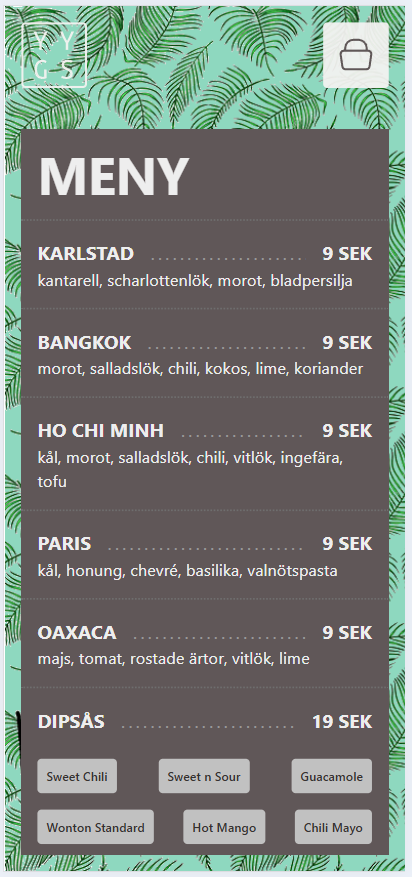

A React-based frontend web app for the fictional foodtruck **Yum Yum Gimme Sum**. The goal was to create an interactive application based on a given Figma sketch and API.

## Features

- **Menu view** - fetches and displays the foodtruck’s menu from the API
- **Shopping cart** - add and remove items with live cart updates
- **Navigation** - switch between menu, cart, and order views using React Router
- **Place order** - submit an order and receive order number + ETA from the API
- **ETA page** - shows countdown until order is ready + order number
- **State management** - global store built with Redux Toolkit

## Tech Stack

- **Vite**
- **React**
- **React Router**
- **Redux Toolkit**
- **SCSS**
- **Custom REST API**

## Preview

**<a href="https://vimeo.com/1065910807/f214fe1f12?share=copy">Code presentation</a>**

